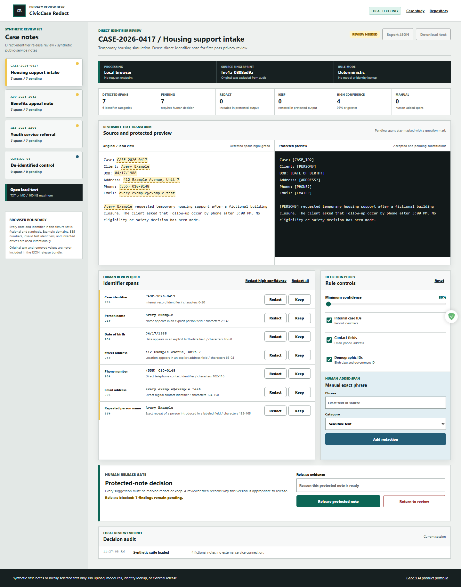

# CivicCase Redact

CivicCase Redact is a local-first browser workspace for reviewing direct identifiers in case-note text before a protected copy is released. It combines offset-preserving deterministic rules, confidence and context evidence, reversible redact-or-keep decisions, manual exact-phrase redaction, and a human release gate.

**Live demo:** https://jubjub-cpu.github.io/civiccase-redact/

**Repository:** https://github.com/jubjub-cpu/civiccase-redact

**Release:** https://github.com/jubjub-cpu/civiccase-redact/releases/tag/v1.0.1



## Product capabilities

- Detects person names, repeated names, email addresses, phone numbers, street addresses, dates of birth, invalid test government IDs, and internal case IDs.
- Preserves exact character offsets, confidence, source, and a plain-language reason for every suggested span.
- Shows original text and a protected preview side by side without mutating the source.
- Keeps pending spans masked while clearly distinguishing accepted redactions and reviewer-kept text.
- Supports per-span decisions, high-confidence review, bulk review, and reversible reopening.
- Lets a reviewer add an exact source phrase as a manual redaction.
- Imports TXT or Markdown files into browser memory with a 100 KB limit.
- Requires every suggestion to be reviewed and a written human note before release.
- Exports protected text and a value-free JSON manifest that excludes the original note and removed identifier values.
- Runs entirely in the browser with no upload, model endpoint, analytics, account, or external release action.

## Why this project exists

Privacy demos often stop at drawing boxes around names. A real review workflow also needs stable offsets, repeated references, reversible false-positive handling, manual additions, an unresolved queue, and a release boundary. CivicCase Redact makes each of those states visible and keeps machine suggestions separate from the human disclosure decision.

## Synthetic fixture suite

| Fixture | Evidence | Expected state |
|---|---|---|
| Housing support intake | Case ID, repeated person, birth date, address, phone, and email | Seven pending spans |
| Benefits appeal note | Contact fields and invalid `000` government-ID fixture | Seven pending spans |
| Youth service referral | Two labeled people, repeated references, phone, address, and case ID | Seven pending spans |
| De-identified control | No configured direct identifiers | Clear state with manual review available |

All notes and identifiers are fictional and synthetic. The fixtures use `.test` domains, `555` phone numbers, an invalid `000` identifier prefix, invented offices, and invented people. They are not derived from a real case, client, agency, or communication.

## Detection contract

The dependency-free engine in [`assets/redaction-engine.mjs`](assets/redaction-engine.mjs) applies explicit patterns to labeled synthetic text. A labeled person seeds exact repeated-name findings. Overlaps are resolved by confidence, and each finding contains only type, offsets, confidence, source, reason, and decision state.

The confidence control is not a claim of statistical model calibration. It is an inspectable priority attached to deterministic rule evidence. Raising the threshold from 80% to 95% removes lower-confidence person and address suggestions; it does not prove that the remaining text is safe.

The runtime uses inspectable deterministic patterns; it does not call a hosted AI model or identity service.

## Reversible human review

Every suggested span starts pending. The reviewer can mark it:

- **Redact:** replace the span with a typed token in protected output.
- **Keep:** restore the source text in protected output as an explicit human decision.
- **Pending:** mask it with a question-mark token and block release.

Returning a released note to review disables exports until the gate is completed again. Manual spans begin as accepted redactions and can also be changed to keep.

## Export boundary

The JSON bundle includes a one-way source fingerprint, character count, protected text, value-free span manifest, review counts, human release evidence, and limitations. It excludes the original note and removed values. The plain-text download includes only the reviewed protected output.

## Run locally

```powershell
node tools/static-server.mjs --port 4213
```

Open `http://127.0.0.1:4213/`.

## Validation

```powershell
node tests/redaction-engine.test.mjs
powershell -ExecutionPolicy Bypass -File tests/validate.ps1 -NodePath "C:\path\to\node.exe"
node tests/browser-smoke.mjs
```

The browser test checks four synthetic fixtures, exact span counts, source highlights, protected preview, reversible keep/redact decisions, policy sensitivity, manual redaction, local file import, release blocking, JSON and text downloads, keyboard navigation, desktop/mobile overflow, failure recovery, console errors, and failed requests.

See [validation evidence](docs/VALIDATION.md), [architecture](docs/ARCHITECTURE.md), and the [case study](docs/CASE_STUDY.md).

## Privacy and security

- No original text, removed value, filename, or decision is transmitted.
- No user accounts, storage, cookies, analytics, or remote APIs.
- No production case-note ingestion or real identifier fixture.
- Export manifests intentionally omit source values.
- Repository validation scans text for common secret and private-email patterns.

## Limitations

- Deterministic patterns can miss identifiers, especially unlabeled names, indirect identity clues, organizations, unusual contact formats, and context-dependent sensitive facts.
- Exact repeated-name matching does not perform entity resolution.
- Confidence values describe rule priority; they are not measured probability estimates.
- A browser-local audit is not immutable evidence or a regulated records system.
- A qualified privacy or records reviewer must inspect the complete context before any real disclosure.

## License

MIT
